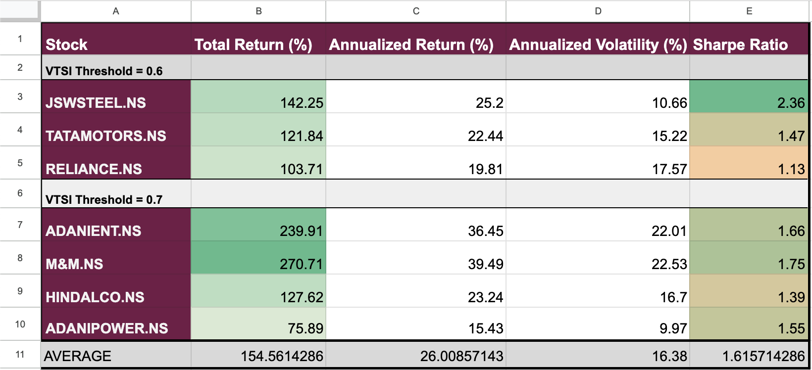

# 📊 Strategy Analysis: Fractal + VTSI

This file provides a deeper dive into the **performance evaluation and interpretation** of the Fractal-VTSI strategy across selected Indian equities.

---

## 🔍 Objective

To analyze how well the strategy performs across different market conditions using key metrics such as:
- **Annualized Return**
- **Volatility**
- **Sharpe Ratio**
- **Win Rate**
- **Trade Frequency & Distribution**

---

## 📈 Overall Observations

- The strategy shows **strong risk-adjusted returns** on high-momentum stocks.
- Most profits come from **trend continuation phases**, where both fractal and volatility triggers align.
- Lower VTSI thresholds (like 0.6) offer **more frequent signals**, while higher thresholds (like 0.7) favor **quality over quantity**.

---

## 📊 Stock-wise Summary

---

## 📌 Key Takeaways

- **Fractals** helped in detecting trend reversals and gave trade oppurtunities
- **Volatility Filter Boosts Precision**: The VTSI filter significantly reduces false positives compared to using fractals alone, leading to better entry timing.
- **Top Performer**: `M&M.NS` delivered the **highest final portfolio return**, showcasing its trend-capturing potential.
- **Safest Bet**: `JSWSTEEL.NS` recorded the **highest Sharpe Ratio**, indicating strong returns with comparatively lower risk.
- **Most Stable**: `ADANIPOWER` exhibited the **lowest volatility**, making it suitable for risk-averse traders.
- **Most Active**: `TATAMOTORS.NS` generated the **highest number of trade signals**, ideal for active and short-term strategies.
- **Average Return** : 154.56% with an Annualised Return rate of 26%

---

## 🧠 Strategy Insights

- Combining **volatility and reversal patterns** helps filter out noisy entries.
- Works best on **trending, high-volume, highly volatile stocks**.
- Could be enhanced further with **position sizing, stoploss**, or **multi-timeframe confirmation**.

---

## 📎 Supporting Files

- See [`/Results`](./Results) for raw performance data.
- Interactive charts in the [Power BI dashboard](https://app.powerbi.com/view?r=eyJrIjoiNmM4YjM4YWQtMzk4My00MWNmLTkwNTMtYmFjZTlmYjJmOWMzIiwidCI6IjkyYzI0YjQ4LTEzMDQtNGMyZi1iMTZjLWQ5MWRhNjY3MTVkOSIsImMiOjl9) provide visual analysis.

---

_Last updated: 28-07-2025_
